# sOS64

## 参考

[《一个64位操作系统的设计与实现》学习笔记](https://github.com/yifengyou/The-design-and-implementation-of-a-64-bit-os)

## 实验记录

### bochs 安装

1. 下载[bochs-2.6.10](https://sourceforge.net/projects/bochs/files/bochs/2.6.10/)或者直接使用`helper/`目录下的压缩包
2. 运行安装脚本`sh ./helper/bochs-install.sh`，可能会有一些依赖错误

### 第一个引导程序

``` shell
# 在 sOS64/src 目录下，编译
make
# 新建一个软盘 =>1=>fd=>1.44M=>a.img
bximage
# 引导程序写入软盘
dd if=boot.bin of=a.img bs=512 count=1 conv=notrunc
# 运行虚拟机 =>6=>c
bochs -f .bochsrc
```

虚拟机运行效果如图：

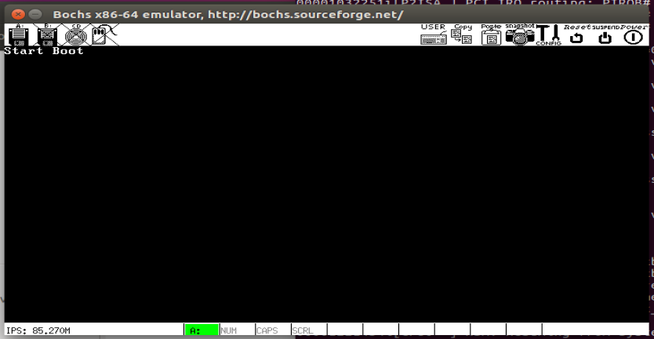

### 加载程序

[操作系统的设计与实现——BootLoader引导加载程序](https://www.sunxiaokong.xyz/2020-08-08/lzx-babyos-1/)

Loader引导加载程序的任务主要有三个：检测硬件信息、处理器模式切换、向内核传递数据。这些工作能够让内核初始化之后正常运行。

- **检测硬件信息** Loader引导加载程序需要检测的硬件信息很多，主要是通过 BIOS 中断服务程序来获取和检测硬件信息 由于 BIOS 在上电自检出的大部分信息只能在实模式下获取，而且内核运行于非实模式下，那么就必须在进入内核程序前将这些信息检测出来，再作为参数提供给内核程序使用在这些硬件信息中，最重要的莫过于物理地址空间信息，只有正确解析出物理地址间信息，才能知道ROM RAM 设备寄存器间和内存空洞等资源的物理地址范围，进而将其交给内存管理单元模块加以维护。

- **处理器模式切换** 从起初 BIOS 运行的实模式（ real mode ），到 32 位操作系统使用的保护模式（ protect mode ），再到 64 位操作系统使用的 IA-32e 模式（ long mode ，长模式）， Loader引导加载程序必须历经这三个模式，才能使处理器运行于 64 位的 IA-32e 模式。

- **向内核传递数据** 这里的数据一部分是控制信息，这部分是纯软件的，比如启动模式之类的东西，另一部分是硬件数据信息，通常是指 Loader 引导加载程序检测出的硬件数据信息 Loader 引导加载程序将这些数据信息多半都保存在固定的内存地址中，并将数据起始内存地址和数据长度作为参数传递给内核，以供内核程序在初始化时分析 配置和使用，典型的数据信息有内存信息、VBE 信息等

``` shell
sudo make
make qemu
```

虚拟机运行效果如图：

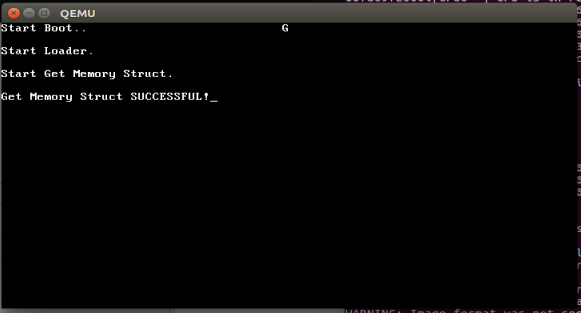

#### 处理器模式切换

处理器开机后默认运行在保护模式，在进入保护模式之前，需要准备一些必要的全局数据结构：
- GDT，LDT（可选）
- TSS（可选），如果想使用硬件多任务或者支持特权级的改变，则必须创建 TSS
- 页表，可选，如果要开启分页模式的话必须要有一个页目录表和页表

在这里，由于只是中间过渡（切换到保护模式后马上就再切换进入长模式），因此先不开启分页模式，也不用准备LDT，因此必须要准备的数据结构只剩下GDT和IDT。GDT中有两个描述符，一个32位代码段描述符，一个32位数据段描述符；而由于在进行模式切换前会使用cli指令（clear interrupt）屏蔽可屏蔽中断，因此这里的中段描述符表IDT只需要分配好空间即可，暂时不需要设置中段描述符。

从实模式切换到保护模式的步骤如下：

1. 关中断
2. 加载 gdt 和 idt
3. （若要使用分页可在这里开启）
4. 置位 CR0.PE，开启保护模式
5. 恢复中断

从保护模式切换到IA-32e模式的步骤如下：

1. 加载 64 位 gdt，并重置各段寄存器
2. 复位 CR0.PG，关闭分页
3. 置位 CR4.PAE，开启物理地址扩展功能（PAE）
4. 将页目录表（顶层页表PML4）的物理基地址加载到 CR3 寄存器中
5. 置位 IA32_EFER.LME，开启 IA-32e 模式
6. 置位 CR0.PG，开启分页机制

虚拟机运行效果如图：

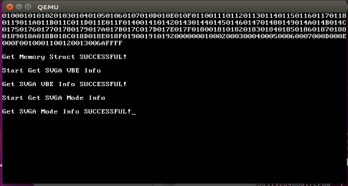

### 中断返回

ret_from_intr

1. softirq_status
2. current.preempt_count
3. current.flags.NEED_SCHEDULE

### 中断驱动的定时器

外部中断的物理逻辑：
外部设备产生中断的电路布线是物理确定的，我们需要对中断控制器进行配置，确定中断控制器的某个引脚接收到信号时，发送给 CPU 的中断向量号，这个中断向量号表示了某个特定的物理设备产生中断。
配置给中断控制器的向量号，应该与配置中断向量表的向量号保持一致性，确保调用正确的中断处理函数

1. 高精度时钟 HPET 定时发送信号给 IO APIC，使后者周期性地产生时钟中断
2. 在统一的中断处理函数 do_IRQ 中根据中断向量号索引到时钟中断处理函数 HPET_handler
3. （上半部）在时钟中断的处理函数 HPET_handler 中
    1. 递增全局时钟计数器 jiffies
    2. 判断是否有到期的定时器，若有就设置全局软中断状态 set_softirq_status(TIMER_SIRQ)，标记有定时器软中断要处理
4. **在中断返回阶段 ret_from_intr，判断是否有软中断需要处理**，若有则根据 set_softirq_status 调用相应的软中断处理函数
5. （下半部）定时器软中断处理函数 do_timer，触发并删除所有到达的定时器

**处理软中断时仍然处于中断上下文中，和上半部的区别在于，处理软中断时处于开中断状态**，允许新的中断产生，即会发生中断嵌套，这加快了中断响应速度。中断嵌套需要注意栈的使用。

### 中断驱动的进程调度

task_struct.preempt_count
抢占标志，记录持有自旋锁的数量，持有自旋锁期间不能进行抢占调度
在中断返回阶段检查 preempt_count 判断是否允许调度，这会导致持有自旋锁时，即便是时间片用完也不会调度，但是下一次时钟中断到来时，时间片减为负，会再次触发调度

当前，HPET 发出的时钟中断只发送给 BSP，BSP 再广播 IPI 给所有 AP，以模拟 AP 的时钟中断
在时钟中断中维护时间片和虚拟运行时间 update_cur_runtime，如果需要调度就进行标记 

task_struct.flags: NEED_SCHEDULE
在中断返回阶段 ret_from_intr，通过标志 NEED_SCHEDULE 判断是否需要进程调度

### 环境搭建

从源代码安装bochs，以便于调试
下载[2.6.10版本源代码](https://sourceforge.net/projects/bochs/files/bochs/2.6.10/)
使用[安装脚本](https://github.com/yifengyou/The-design-and-implementation-of-a-64-bit-os/blob/master/bochs/onekey.sh) `sudo ./onekey.sh`
跳转到虚拟机目录 `cd bochs-2.6.10`
新建虚拟机[配置文件 .mybochsrc](https://github.com/yifengyou/The-design-and-implementation-of-a-64-bit-os/blob/master/code/c02/bochsrc)
运行 `bochs -f .mybochsrc`

[bochs调试方法与指令详解](https://blog.csdn.net/liu0808/article/details/53099099)

[sh脚本异常：/bin/sh^M:bad interpreter: No such file or directory](https://www.jianshu.com/p/503698302d80)
[ubuntu上安装nasm](https://blog.csdn.net/liangxanhai/article/details/8521937)
[gcc和g++降级、升级_Ubuntu18 LTS](https://www.jianshu.com/p/7c73e386f0e4)

### 内存管理结构

物理内存空间布局：

``` c
/*
____________________
|   system code
|____________________
|   pages bitmap
|____________________
|   array of <struct page>
|____________________
|   array of <struct zone>
|____________________
|   array[16] of <struct Slab, Slab's bitmap>
|____________________
|   16 pages for <kmalloc slab>
|____________________
|   任意使用的空间
|           ...
|____________________
*/
```

#### 堆内存分配 kmalloc

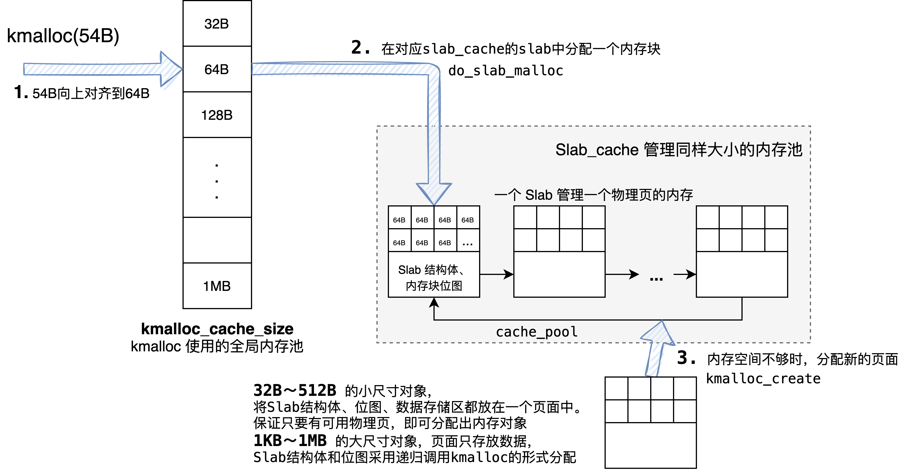

## 物理机迁移

遇到的问题：

1. U 盘大小影响 BIOS 汇编。
2. intel-i5-10500 华硕主板，可以进入 boot，正常读取扇区，但是找不到 loader.bin 对应的目录项。使用 AMD R5-3500x 微星B450，可以正常进入到 loader，但是不能正常跳转到 kernel。如下图：在这一句之前加上 “jmp $” 是能够正常停住的，但是在 head.S 开头添加的原地循环却不能停住，所以推测是跳转的问题。

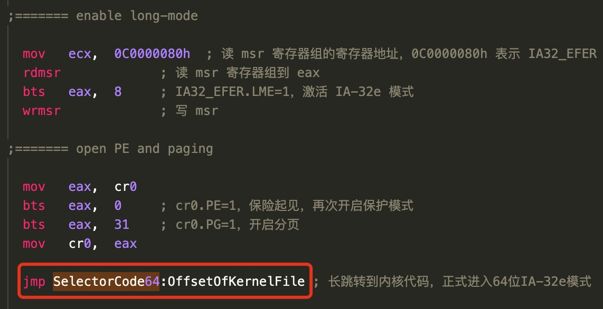

3. 最终抛弃 BIOS 方式，采用 UEFI 引导。在用 DiskGenus 配置 UEFI 引导的时候需要使用较大的 U 盘，32 MB 的不可行，最终用了 16GB 的 U 盘。
4. 使用 UEFI 能正常引导，但是在物理平台上，帧缓存的重映射之后不能正常 print。打印重映射的所有步骤，没有发现异常。最终解决方法是在设置 Pos.FB_addr 之前手动将 YPosition 设为一个较小的数。🤔️这里需要看看是否有其他更合理的解决方案

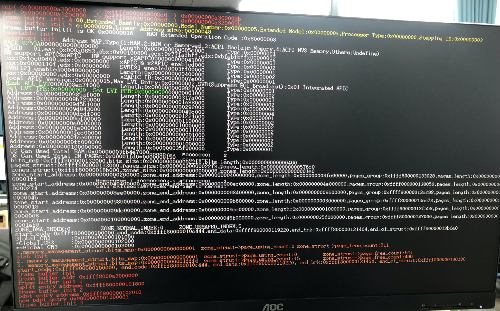

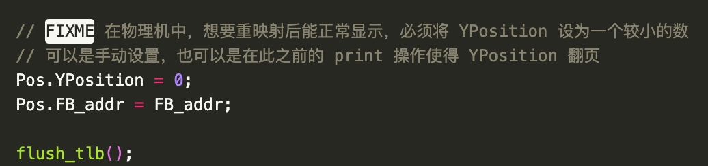

5. 初始化 I/O APIC 时，当前架构的物理平台下已经不需要初始化 OIC 寄存器了，按照书上写的代码找到的 RCBA 寄存器地址是错误的，将在后面读取 OIC 寄存器时造成缺页错误，因为较新的物理平台下已经没有 RCBA 寄存器了。

[I/O APIC没有必要初始化OIC寄存器](https://blog.csdn.net/defrag257/article/details/111939545)
芯片组相关的 OIC 寄存器（较新版本叫 IOAC 寄存器），实际上是用于 BIOS 上电初始化的，操作系统不用写这个寄存器！没有标准化、每个芯片组都不一样的寄存器，一般不是为操作系统编程而设计的，而是为 BIOS 上电初始化、厂商驱动程序而设计的。此外 IMCR 寄存器可选存在于早期基于 MP 的系统中，对于现代的基于 ACPI 的系统，不存在 IMCR 寄存器，但强行写这个寄存器也没事。**操作系统只需要屏蔽 8259A（使用 8259A 的 IMR，或屏蔽 LINT0 和 RTE0）、初始化 I/O APIC 的 ID 寄存器和 24 个 RTE 寄存器即可**。

[实验平台 410 芯片组白皮书 Intel® 400 Series Chipset Family Platform Controller Hub](https://cdrdv2.intel.com/v1/dl/getContent/620855?explicitVersion=true)
[书本平台 IntelQM67 芯片组白皮书 Intel® 6 Series Chipset and Intel® C200 Series Chipset](https://www.intel.com/content/dam/www/public/us/en/documents/datasheets/6-chipset-c200-chipset-datasheet.pdf)
[LAPIC 和 IOAPIC](https://zhuanlan.zhihu.com/p/313725721)

### BIOS 引导

#### 16mb u盘的扇区计算

```asm
RootDirSectors            equ   14  ; 根目录占用的扇区数
                                    ; (BPB_RootEntCnt * 32 + BPB_BytesPerSec - 1) / BPB_BytesPerSec = 14
SectorNumOfRootDirStart   equ   13  ; 根目录的起始扇区号
                                    ; BPB_RsvdSecCnt + BPB_FATSz16 * BPB_NumFATs = 13
SectorNumOfFAT1Start      equ   1   ; FAT1 表的起始扇区号，FAT1前只有一个保留扇区（引导扇区）

  BS_OEMName      db  'MINEboot'      ; 生产商名称
  BPB_BytesPerSec dw  0x200           ; 每扇区字节数 512
  BPB_SecPerClus  db  0x8             ; 每簇扇区数 8
  BPB_RsvdSecCnt  dw  0x1             ; 保留扇区数 1
  BPB_NumFATs     db  0x2             ; FAT 表的份数 2
  BPB_RootEntCnt  dw  0xe0            ; 根目录可容纳的目录项数 224
  BPB_TotSec16    dw  0x3ec1          ; 总扇区数 16065
  BPB_Media       db  0xf0            ; 介质描述符
  BPB_FATSz16     dw  0x6             ; 每 FAT 扇区数 6
  BPB_SecPerTrk   dw  0x3f            ; 每磁道扇区数 63
  BPB_NumHeads    dw  0xff            ; 磁头数 255
  BPB_HiddSec     dd  0               ; 隐藏扇区数
  BPB_TotSec32    dd  0               ; 如果 BPB_TotSec16=0，则由这个值记录扇区数
  BS_DrvNum       db  0               ; int 13h 的驱动器号
  BS_Reserved1    db  0               ; 未使用
  BS_BootSig      db  29h             ; 扩展引导标记
  BS_VolID        dd  0               ; 卷序列号
  BS_VolLab       db  'boot loader'   ; 卷标
  BS_FileSysType  db  'FAT12   '      ; 文件系统类型
```
  
  window 自动添加 System Volume Information 文件夹到 u 盘
  [How to prevent creation of "System Volume Information" folder in Windows 10 for USB flash drives?](https://superuser.com/questions/1199823/how-to-prevent-creation-of-system-volume-information-folder-in-windows-10-for)
  [Prevent System Volume Information folder creation on USB in Windows 10](https://www.thewindowsclub.com/prevent-system-volume-information-folder-usb)

#### 显示信息

BIOS 引导方式需要使用 BIOS 中断手动读取物理平台支持的显示模式，
在 loader.asm 中有输出显示模式信息的功能，逐字节对比（注意小端序），可以发现物理平台的帧缓存起始地址是 `0xF1000000`

`BF00 0700 4000 4000 00A0 0000 B781 00C0 0010
04 00* 03 00* 10 08 20* 01 06* 01 00 01 01 08 10 08 08 08 00 08 18 00
0000 F100`

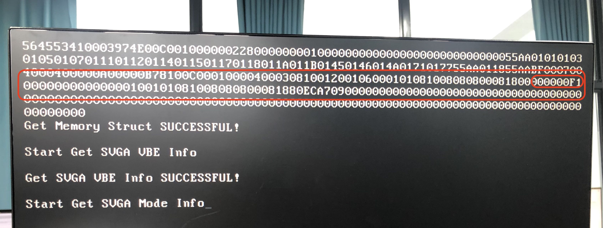

### 引导程序从 BIOS 迁移到 UEFI

[UEFI 引导程序的实现](media/16246009141842/UEFI%20%E5%BC%95%E5%AF%BC%E7%A8%8B%E5%BA%8F%E7%9A%84%E5%AE%9E%E7%8E%B0.mobi)
[一个UEFI引导程序的实现](media/16246009141842/%E4%B8%80%E4%B8%AAUEFI%E5%BC%95%E5%AF%BC%E7%A8%8B%E5%BA%8F%E7%9A%84%E5%AE%9E%E7%8E%B0.pdf)

UEFI 引导方法需要编写 UEFI 应用

显示信息
|类型| 分辨率 | 地址 | 大小 |
|---|---|---|---|
| VM | 1280 1024 | 0xf0000000 | 0x00500000 |
| PC | 1280 1024 | 0xA3000000 | 0x00500000 |

1. head.S
    1. UEFI 自身设置了段选择子，需要在一开始调整段选择子
    2. 修改内存的页表映射，UEFI 引导程序中自动根据选择的显示模式将帧缓冲区映射到 0xffff800003000000 处；BIOS 模式需要手动添加页表映射，帧缓冲区的首地址在每个平台下都不同，需要由 BIOS 中断读取出来，手动指定。帧缓冲区首地址的平台相关性也导致了 VM 和物理机不能用同一套代码（其实是可以的，但是要手写汇编，在固定地址处传递给内核），UEFI 修复了这一问题。
2. 从引导中获取信息的方式改变。
    1. 内存管理单元程序解析物理地址空间 `init_memory()`
    2. 重映射帧缓冲区 `void frame_buffer_init() `
    3. `Start_Kernel()` 中对显示信息 `struct position Pos` 的初始化
3. 在内核主程序中清除bss段内的脏数据以防止全局数据结构遭受污染

#### BIOS 和 UEFI 有什么区别

[UEFI 引导与 BIOS 引导在原理上有什么区别](https://www.zhihu.com/question/21672895)

UEFI 和传统 BIOS 在启动引导过程原理上没有本质区别。
BIOS 和 UEFI 的最主要的功能：初始化硬件和提供硬件的软件抽象。BIOS 通过中断的形式提供了一定的抽象性，但还不够。
UEFI 能够更好的完成 PC 固件的终极目的：**初始化硬件，提供硬件的软件抽象，和启动操作系统**。如果说有什么东西帮助 UEFI 打败了传统 BIOS，那这些东西就是：**标准接口、开放统一和开源**。

### 磁盘驱动

书本上的磁盘驱动使用了 IDE 接口，但是目前大多数的主板（可见410 芯片组白皮书）并不支持这种古老的接口了。但是 VM 虚拟机支持 IDE 磁盘，添加 IDE 磁盘，在高级设置中选择虚拟设备节点为 `IDE 0:0`

> TODO 物理机应实现 AHCI 接口的驱动，见 [publishOS-AHCI](https://gitee.com/MINEOS_admin/publish/tree/develop/kernel/DeviceDriver/AHCI)

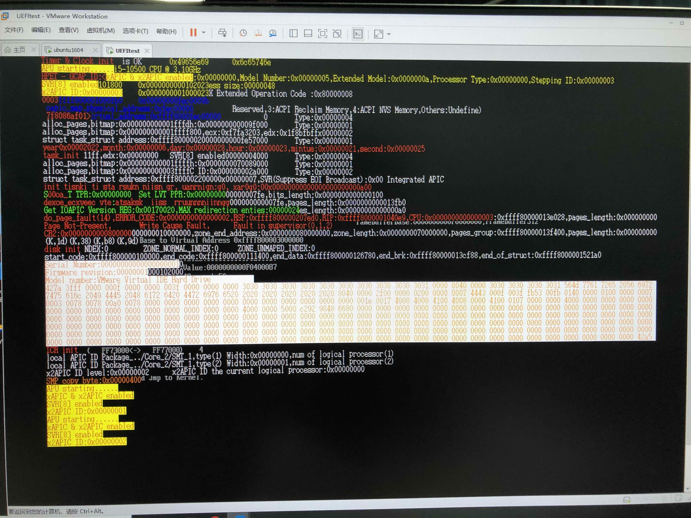

## SMP 架构支持

### 多核设备的启动流程

1. BSP 启动，将 AP 的启动代码拷贝到物理地址 0x20000 处
2. BSP 发送 IPI（INIT和Start-up）给AP。AP 的起始地址由 Start-up IPI 给出，设置起始时 cs=0x2000，则起始运行地址为 cs<<4+ip = 0x20000
3. AP 在 APU_boot.S 中从 0x20000 开始运行，AP 的起始运行于实模式中，需要经历一个完整的 实模式->保护模式->长模式 的过程，所以需要保证一致性映射存在；
4. 接着跳转到 head.S 中从 0x100000 继续运行，设置各种描述符表。所有核心共享 gdt、idt；
5. 最后跳转到 Start_SMP() 而不是 Start_Kernel()，因为 AP 不需要重复执行内核各模块的初始化工作了

### AP 和内核的融合

#### 转移代码

AP 的启动代码 APU_boot.S 和内核一起编译，起始地址是 0xffff800000100000，但是实际运行在物理地址 0x20000 处，故该文件中不能使用绝对地址，对地址的访问全部要使用相对地址。这一点类似于动态链接的使用，动态链接器也是被动态链接进程序地址空间的，它本身要能够自启动。

启动 AP 中有一个关键点是要将 AP 的启动代码加载到物理地址 0x20000 处。当前使用的计算机是冯诺伊曼架构，指令和数据都存储在主存中，并且，本系统的代码段和数据段互相重叠，数据和代码的地址统一。在 APU_boot.S 的首尾定义了标志符 _APU_boot_start 和 _APU_boot_end，标明了引导程序的起始地址和结束地址，故可以在运行时找到 AP 的启动代码，我们要做的只是将这一部分内存空间的数据直接拷贝到物理地址 0x20000 处。

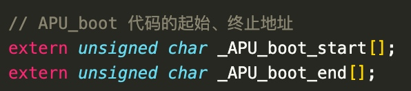


#### 栈

每个核心使用的段描述符和中断门描述符是相同的，所以所有核心共享 GDT 和 IDT。
每个核心需要处理各自独立的任务，所以每个核心需要有独立的 TSS 和 栈。在 BSP 的 Start_Kernel 中为每个的栈申请空间，并设置 _stack_start，AP 在 head.S 中使用 _stack_start 设置 rsp。即 BSP 和 AP 在 head.S 中都用 _stack_start 设置栈。逻辑统一，只需要为 BSP 在 head.S 中手动设置栈，AP 都通过 Start_Kernel 动态申请栈。

### 同步问题

AP 是由  BSP 拉起的。
BSP 执行环境所需的内存空间（stack，tack_struct，thread_struct）都是在代码中采用全局变量的形式静态分配的，而 AP 执行环境所需的内存空间都是在 BSP 的执行路径中动态分配的。需要先有执行环境，AP 才能进行初始化，故需要进行同步，`BSP 申请空间 -> AP 开始初始化 -> BSP 为下一个 AP 服务 ...`
这里把 `SMP_lock` 当作资源量为 1 的信号量使用，同步 BSP 和 AP。BSP 依次服务每个 AP，AP 启动完毕后在 `Start_SMP()` 中释放信号量，BSP 才能为下一个 AP 服务。

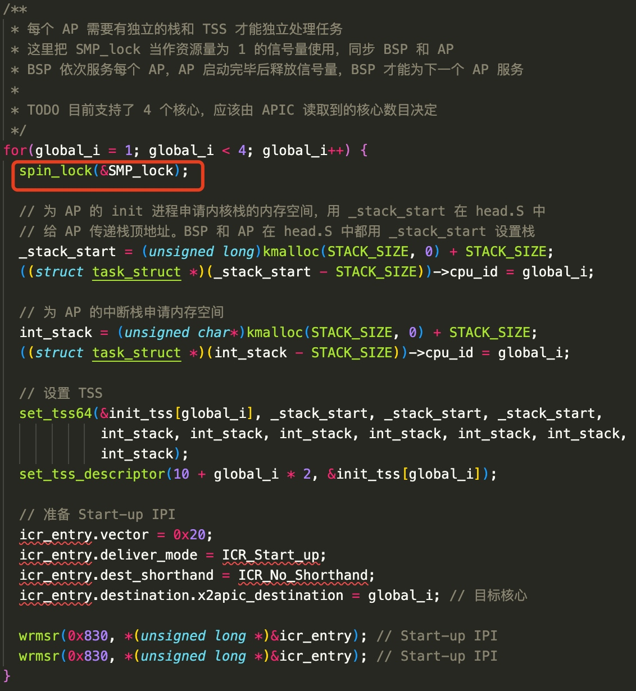
